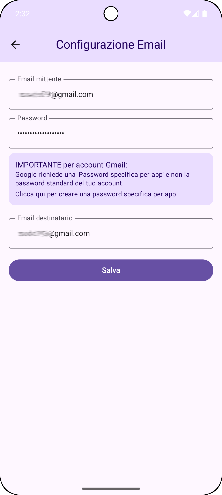
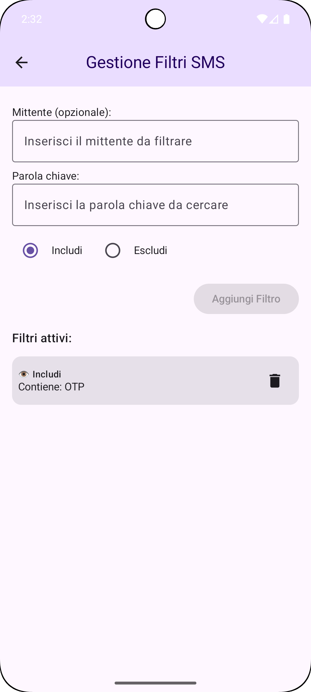
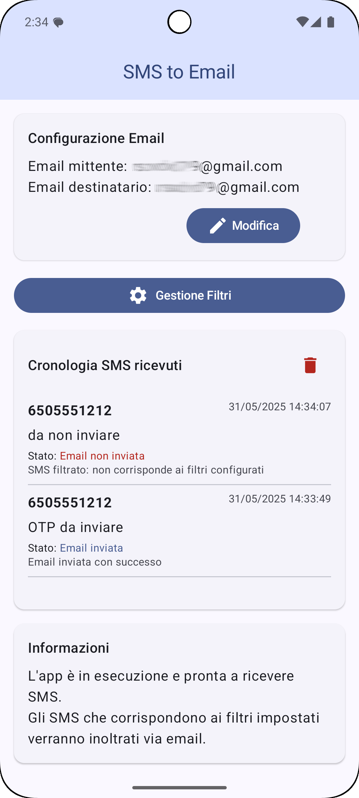

# smsTOmail

> Inoltra automaticamente gli SMS ricevuti via email — configura una volta, dimentica per sempre.


---

## Screenshot

| Schermata principale | Configurazione Email | Gestione Filtri |
|:---:|:---:|:---:|
|  |  |  |

---

## Funzionalità

- 📨 **Inoltro automatico SMS** — ogni SMS tradizionale (GSM) ricevuto viene inviato via email in tempo reale
- 🔍 **Filtri avanzati** — includi o escludi SMS per mittente e/o parola chiave
- 🔒 **Password cifrata** — la password SMTP è protetta con AES-256/GCM tramite Android Keystore
- 📋 **Cronologia SMS** — log degli SMS ricevuti con stato dell'invio email
- ⚙️ **SMTP configurabile** — compatibile con Gmail (porta 587 STARTTLS) e provider con SSL diretto (porta 465, es. Aruba)
- 🔔 **Notifiche di errore** — avvisi immediati in caso di problemi di autenticazione email
- 🌍 **Multilingua** — interfaccia in italiano e inglese

---

## Requisiti

| Componente | Versione minima |
|---|---|
| Android | 7.0 (API 24) |
| Android Studio | 2024.1 (Koala) o superiore |
| JDK | 11 o superiore |
| Gradle | fornito dal wrapper (9.4.1) |

---

## Build e installazione

```bash
# Clona il repository
git clone https://github.com/rsodvd79/smsTOmail.git
cd smsTOmail

# Build APK debug
./gradlew app:assembleDebug          # Linux/macOS
gradlew.bat app:assembleDebug        # Windows

# Test unitari
./gradlew app:testDebugUnitTest

# Test strumentati (richiede dispositivo/emulatore connesso)
./gradlew app:connectedDebugAndroidTest

# Lint
./gradlew app:lintDebug
```

> **Nota Windows:** se `JAVA_HOME` punta a un JDK non valido, impostarlo esplicitamente prima del comando:
> ```powershell
> $env:JAVA_HOME = 'C:\Program Files\Android\Android Studio\jbr'
> ```

---

## Compatibilità

| API | Note |
|---|---|
| API 24–28 | Supporto completo |
| API 29+ (Android 10+) | Foreground service avviato con tipo `DATA_SYNC` esplicito |
| API 33+ (Android 13+) | Richiesta runtime del permesso `POST_NOTIFICATIONS` |
| API 35+ (Android 15+) | Edge-to-edge obbligatorio — tutte le Activity chiamano `enableEdgeToEdge()` |
| API 37 (Android 16+) | Testato su emulatore; stabile su dispositivo fisico |

---

## Configurazione dell'app

### 1. Permessi richiesti

Al primo avvio l'app chiede i permessi necessari:

| Permesso | Motivo |
|---|---|
| `RECEIVE_SMS` | Intercettare gli SMS tradizionali (GSM) in arrivo |
| `INTERNET` | Inviare email via SMTP |
| `POST_NOTIFICATIONS` | Mostrare notifiche di errore (Android 13+) |

### 2. Configurazione email

Dalla schermata **Configurazione Email** puoi scegliere tra due modalità di invio:

#### 🔵 Modalità SMTP (Senza Cloud Console)

Configurazione manuale del server di posta in uscita:

| Campo | Descrizione |
|---|---|
| Email mittente | Account da cui partono le email di inoltro |
| Password | Password SMTP (vedi sotto per Gmail) |
| Host SMTP | Es. `smtp.gmail.com` |
| Porta SMTP | `587` (STARTTLS) oppure `465` (SSL diretto) |
| Usa TLS | Attivo per porta 587; disattivare per porta 465 |

#### 🟢 Modalità Gmail API (Con Cloud Console)

Autenticazione OAuth 2.0: l'utente accede con il proprio account Google. Non è necessario inserire password SMTP.

**Prerequisiti (operazione una-tantum per lo sviluppatore):**
1. Crea un progetto su [console.cloud.google.com](https://console.cloud.google.com)
2. Abilita la **Gmail API**
3. Crea credenziali **OAuth 2.0** di tipo *Android* (con l'SHA-1 del certificato di firma)

**Per l'utente finale:**  
Tocca **Accedi con Google**, scegli l'account Gmail, autorizza l'accesso. Fine.

#### Campi comuni (entrambe le modalità)

| Campo | Descrizione |
|---|---|
| Email destinatario | Indirizzo a cui ricevere gli SMS inoltrati |
| Firma | Testo aggiunto in fondo a ogni email |
| Max SMS in cronologia | Numero massimo di voci nel log locale |

#### Gmail — Password specifica per app (solo modalità SMTP)

Gmail richiede una **password specifica per app** al posto della password dell'account:

1. Vai su [myaccount.google.com/apppasswords](https://myaccount.google.com/apppasswords)
2. Crea una nuova password per "smsTOmail"
3. Usa quella password nel campo **Password** dell'app

### 3. Filtri SMS

Dalla schermata **Gestione Filtri** puoi creare regole per decidere quali SMS inoltrare:

| Tipo | Comportamento |
|---|---|
| **INCLUDI** | Solo gli SMS che corrispondono a questo filtro vengono inoltrati |
| **ESCLUDI** | Gli SMS che corrispondono a questo filtro vengono bloccati |

I campi **Mittente** e **Parola chiave** sono entrambi opzionali: lasciare un campo vuoto significa "qualsiasi valore". I filtri ESCLUDI hanno sempre **precedenza** sugli INCLUDI.

> Se non viene configurato alcun filtro, **tutti gli SMS vengono inoltrati**.

> ⚠️ **Limitazione:** l'app intercetta solo gli **SMS tradizionali (GSM/SS7)** tramite il broadcast `SMS_RECEIVED`. I messaggi **RCS** (Rich Communication Services), **MMS** e i messaggi in-app (WhatsApp, Telegram, ecc.) **non vengono intercettati**.

---

## Architettura

```
SmsReceiver (BroadcastReceiver)
    └─► SmsFilterProcessor     — valuta i filtri INCLUDE/EXCLUDE
    └─► EmailSender            — invia via JavaMail SMTP (modalità SMTP)
    └─► GmailApiSender         — invia via Gmail REST API + OAuth 2.0 (modalità Gmail API)
    └─► Room (AppDatabase)
            ├─ FilterDao       — regole di filtraggio
            ├─ EmailConfigDao  — configurazione email (riga unica, id=0)
            └─ SmsLogDao       — cronologia SMS + stato invio

SmsBackgroundService (ForegroundService)
    └─► path alternativo (avviato da BootReceiver al riavvio)

UI: Jetpack Compose
    ├─ MainActivity            — cronologia SMS + navigazione
    ├─ EmailConfigActivity     — configurazione SMTP
    └─ FilterActivity          — gestione filtri
```

**Sicurezza:** la password SMTP è cifrata con AES-256-GCM tramite Android Keystore prima di essere salvata in SQLite.

---

## Changelog

### 2026.05.08
- Aggiunta scelta della modalità di invio email nella schermata **Configurazione Email**:
  - **SMTP (Senza Cloud Console)** — configurazione manuale del server SMTP (comportamento precedente)
  - **Gmail API (Con Cloud Console)** — autenticazione OAuth 2.0 tramite account Google; nessuna password SMTP richiesta
- Nuovo file `GmailApiSender.kt`: invia email via Gmail REST API usando un token OAuth ottenuto da `GoogleAuthUtil`
- Aggiornato `SmsReceiver` per instradare l'invio a `GmailApiSender` o `EmailSender` in base alla modalità configurata
- Schema Room aggiornato a versione 7 (nuovi campi `authMode` e `oauthAccount` in `email_config`)

### 2026.05.07
- Versione aggiornata a 2026.05.07

### 2026.05.06
- Fix: aggiunto `enableEdgeToEdge()` in `EmailConfigActivity` e `FilterActivity` (necessario per Android 15+ / API 35+)
- Fix: `startForeground()` in `SmsBackgroundService` ora specifica `FOREGROUND_SERVICE_TYPE_DATA_SYNC` su API 29+ (obbligatorio con `foregroundServiceType` dichiarato nel manifest)
- Fix: sostituito `launchWhenStarted` (deprecato) con `repeatOnLifecycle(Lifecycle.State.STARTED)` in `MainActivity`

---

## Privacy

La app non invia dati a server di terze parti. Gli SMS vengono inoltrati direttamente dal dispositivo al server SMTP configurato dall'utente. Consulta [`privacy_policy_it.html`](privacy_policy_it.html) per i dettagli.

---

## Licenza

Distribuito sotto licenza **MIT**. Vedi [LICENSE](LICENSE) per i dettagli.

